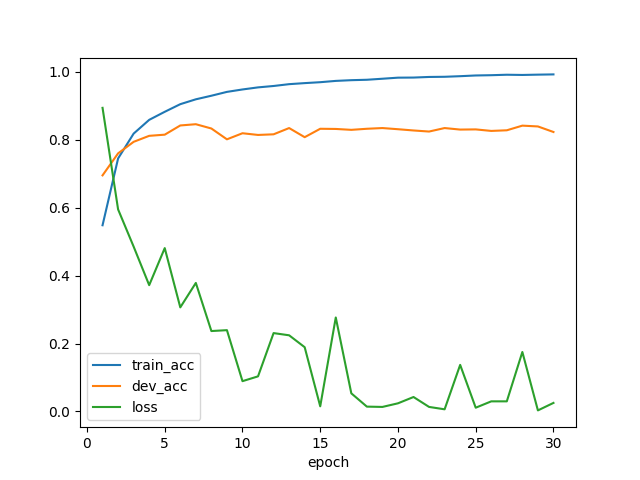
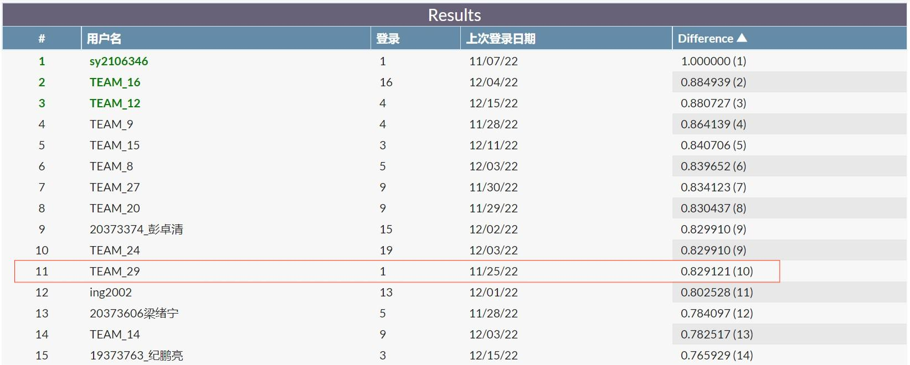

### 数据预处理

- 数据分割的两种尝试：
    - 将所有数据作为训练集，不设验证集——尽可能增加训练数据
    - 分割出与测试集相同大小的验证集，用于训练过程中的泛化能力评估

为了尽可能增加训练数据，本实验选用所有标注数据作为训练集，不设验证集。但为了保证最终选用模型的泛化能力，子实验分割出与测试集相同大小的验证集，以验证集准确率确定超参数。

- 数据内容粗处理
    - 评论特点：#Tag＋评论内容（@提及、表情）＋网址
        - #Tag多嵌在评论内容中，部分评论仅含Tag而不含其他内容 。Tag可以与情感相关。
        - @提及大多涉及人名，认为去掉人名在一定程度上破坏了句子完整性。
        - 表情符号在数据中出现并不多，且表情种类与评论情感分类没有特别强的相关性。不少样例中`:)`出现在 $Negative$ 类，`:(`出现在 $Positive/Extremely\ Positive$ 类。
        - 网址位于每条评论末尾，且网址内容与情感无关
    - 处理方法：截断每条评论后的网址，仅保留Tag和正式评论内容

- 分词-编码
    - 采用 `bert-base-uncased` 的分词方法
    - 加入特殊符号 `[CLS]` 和 `[SEP]`
    - 统计数据集句子最大长度作为 `max_length`，并以0作为padding标识

```python
encode_dict = tokenizer.encode_plus(text=example.text,
                                    add_special_tokens=True,
                                    max_length=max_seq_length,
                                    padding='max_length',
                                    return_token_type_ids=True,
                                    return_attention_mask=True,
                                    truncation=True)
input_ids = encode_dict['input_ids']
input_mask = encode_dict['attention_mask']
segment_ids = encode_dict['token_type_ids']
```

### 模型实现

```python
class ClassifierModel(nn.Module):
    def __init__(self,
                 bert_dir,
                 dropout_prob=0.1):
        super(ClassifierModel, self).__init__()
        # 加载预训练模型
        self.bert_module = BertModel.from_pretrained(bert_dir)
        # 加载预训练模型的参数配置
        self.bert_config = self.bert_module.config
        # 以一定概率丢弃神经元，用于防止过拟合
        self.dropout_layer = nn.Dropout(dropout_prob)
        # 实体化一个单层前馈分类器：两层全连接中间加一个ReLU激活函数，最后将输出变为5维（目标类别共5类）
        # # 64是分类器隐藏维度，实验发现这个超参数对最终的准确率影响不大
        out_dims = self.bert_config.hidden_size
        self.obj_classifier = nn.Sequential(
            nn.Linear(out_dims, 64),
            nn.ReLU(),
            nn.Linear(64, 5)
        )
        
   def forward(self,
               input_ids,
               input_mask,
               segment_ids,
               label_id=None):
        bert_outputs = self.bert_module(
            input_ids=input_ids,
            attention_mask=input_mask,
            token_type_ids=segment_ids
        )
        # 为分类任务提取标记[CLS]的最后隐藏状态
        last_hidden_state_cls = bert_outputs[0][:, 0, :]
        # 随机丢弃神经元，防止过拟合
        last_hidden_state_cls = self.dropout_layer(last_hidden_state_cls)
        # 分类
        out = self.obj_classifier(last_hidden_state_cls)
        return out
```

### 训练过程

```python
# 获取batch数据
input_ids = batch_data['input_ids'].to(device)
input_mask = batch_data['input_mask'].to(device)
segment_ids = batch_data['segment_ids'].to(device)
label_id = batch_data['label_id'].to(device) 
					if batch_data['label_id'] is not None else None

# 归零导数
my_model.zero_grad()
# 获取现阶段模型输出
output = my_model(input_ids, input_mask, segment_ids, label_id)
train_acc += (output.argmax(1) == label_id).sum()

# 计算交叉熵损失值
loss = loss_fn(output, label_id)
train_loss += loss.item()
# 反向传播
loss.backward()
# 归一化，防止梯度爆炸
torch.nn.utils.clip_grad_norm_(my_model.parameters(), 1.0)
# 根据网络反向传播的梯度信息更新网络的参数
optimizer.step()
```

### 模型选择

训练过程设置 `epoch=30`，即将所有数据迭代训练30个轮次。训练过程模型输出 `loss` 及训练/测试准确率变化如下图所示。



由上图线可知，随着迭代轮次增加，准确率趋于平缓，loss部分震荡但总体下降至平缓。选用三者皆稳定的模型 `epoch=20`。

### 预测效果

